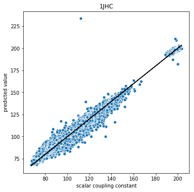
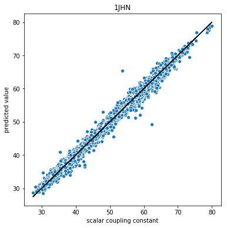
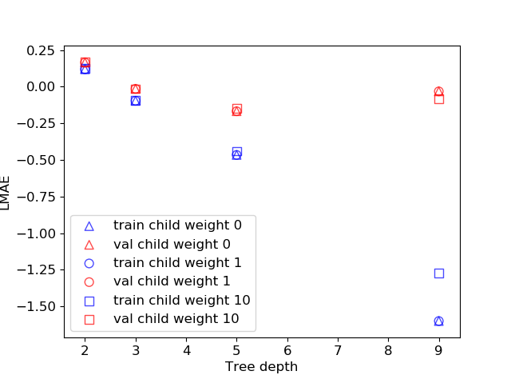

# Predicting molecular properties with machine learning

E-Dean Fung ([ef2486@columbia.edu](mailto:ef2486@columbia.edu)) and Sai Sunku ([sss2236@columbia.edu](mailto:sss2236@columbia.edu))


## Introduction

Computational techniques for predicting chemical properties of molecules are important for interpreting experimental data and exploring new avenues of research. Historically, this has been achieved by using computational quantum chemistry techniques such as Density Functional Theory and Quantum Monte Carlo, which require expert domain knowledge and typically scale poorly with the number of atoms in the molecule. Modern machine learning techniques have shown some [promise](https://arxiv.org/abs/1909.02487?fbclid=IwAR3-k3UC5mvHM13MX3qYMDfyvMl_WxA4r2OWPPstA6lNTUUuMTWsO-f5avs) in making computational quantum chemistry faster and more accessible to researchers of all kinds.

Nuclear Magnetic Resonance (NMR) is an experimental technique used in chemistry and biology to determine molecular structure and dynamics. Interpreting NMR data requires an understanding of the scalar magnetic coupling between the atoms in a molecule. In the following Kaggle [challenge](https://www.kaggle.com/c/champs-scalar-coupling), we explore the use of Dense Neural Networks and Boosted Trees to the problem of predicting the scalar magnetic coupling between two atoms in a molecule.

Data is provided by the [Chemistry and Mathematics in Phase Space](https://champsproject.com/) project.

The validation metric used for this project is the log of mean absolute error (LMAE) defined as follows:


where  is the type of the coupling (defined below) and  is the number of atom-pairs of that type.


## Data Exploration

Each record gives the molecule name, the two atoms of interest, and the coupling type. In the train data, the scalar coupling constant (target) is also provided.

Let us take a quick look at the imbalances in the data. Calculations are performed [here](https://www.kaggle.com/edeanf/190621-predmolprop-exploration).

One concern is that some molecules are better represented than others. That is, a large molecule has many atoms, and thus has many more possible scalar coupling constants (one for each pair of atoms). Thus, trends found in larger molecules may be overrepresented.

We confirm this suspicion by looking at how many times a single molecule appears in the dataset and building a histogram of those counts. On average, a molecule appears around 50 times. Borrowing from a [kernel](https://www.kaggle.com/seriousran/just-speed-up-calculate-distance-from-benchmark) shared by Chanran Kim to calculate the number of atoms in each molecule, we confirm that the number of appearances is correlated with the size of the molecule.

Train | Test
--- | ---
 | 
 | 


The second major imbalance is in the coupling types. The coupling type is defined by the number of bonds between the two terminating atoms, then the type of the two terminating atoms. The data only considers coupling between atoms with 1, 2, or 3 bonds in between. One of the atoms is always hydrogen and the second atom can either be hydrogen, carbon, or nitrogen, resulting in 8 total coupling types (since 1JHH would only occur in the H2 molecule).


We see that H-C coupling is well represented, regardless of the number of bonds, followed by H-H coupling, and then H-N coupling. The imbalances are the same between the test and train data. We observed that most public notebooks dealt with this imbalance by building a separate model for each type, which is reasonable since each type has fairly different distributions of scalar couplings (see figure below), although certain trends such as the dependence on bond length may be lost.


Above, we plot the distributions of scalar coupling for each type provided by the training dataset. Roughly speaking, the smaller the number of bonds between the two terminating atoms, the smaller the coupling constant. Most coupling constants are positive, with the exception of 2JHH, which is consistently negative. Most distributions show multiple peaks.


## Data Engineering

We extracted features using the open source cheminformatics API Open Babel. Looking at the public notebooks, we saw that distance features seemed to play the largest role. We split these distance features into two broad categories: features pertaining to the molecule as a whole (Molecule Distance Features) and features pertaining to the two terminating atoms (Coupling Distance Features). Feature engineering was split into two kernels because of time constraints and are found [here](https://www.kaggle.com/edeanf/predmolprop-featureengineering-slow) and [here](https://www.kaggle.com/edeanf/predmolprop-featureengineering-finaltrain). 

**Molecule Distance Features**
*   Min, mean, and max distance between any two atoms
*   Min, mean, and max distance between each atom and the geometric center (mean position is 3D space)
*   Total number of atoms
*   Total number of bonds
*   Number of carbons, hydrogens, nitrogens, oxygens, and fluorine atoms


**Coupling Distance Features**
*   The “through space” distance between the two terminating atoms. That is, the Euclidean distance between the two atoms.
*   The “through bond” distance between the two atoms. That is, what is the minimum distance if we must travel through the molecular bonds. For coupling with only one bond, this distance is the same as the through space distance, but for couplings with two or three bonds, this distance is larger.
*   For each terminating atom:
    *   Distance to the geometric center
    *   Min, mean, and max distance to any other atom, regardless of type
    *   Min, mean, and max distance to all the carbon, oxygen, nitrogen, and fluorine atoms, respectively.

From a physical point of view, we expected the electron density to play a role in determining the scalar coupling. Finding the true electron density requires the same ab initio methods we are trying to avoid by using machine learning, but we hoped that by including additional information about the bonds in between the two terminating atoms, we could capture some of this information. Most of these features are only relevant for couplings with more than one bond. 

**Bond Features**
*   Number of paths: In general, there can be multiple bond paths between the two terminating atoms. We included the number of paths found, but for all the properties below, we just choose one of these paths as representative.
*   Bond angles: For couplings with two bonds in between, we calculate the angle between the two bonds. For couplings with three bonds, we calculate the tetrahedral angle between the non-central bonds. An indicator column is included for linear atoms, where the tetrahedral angle is not well defined. Chemists have previously discovered that bond angles are strong predictors of the scalar coupling constant (e.g., [Karplus equation](https://en.wikipedia.org/wiki/Karplus_equation)).
*   Bond orders
*   Open Babel Atom Types of intermediate atoms: For example, if there are two bonds, there is one intermediate atom. Open Babel infers additional information about the atoms, not just their atomic number. For example, a carbon atom can be represented as C1, C2, C3, Car, or C+. 

Finally, we include some features that Open Babel provides for the terminating atoms. We compute these features for both terminating atoms, but most of them are the same for hydrogen and are dropped later.

**Terminating Atom Features**
*   Open Babel Atom Types
*   Orbital hybridization
*   Valence
*   Partial charge
*   Formal charge


## Baseline Linear Regression Model

Kaggle Notebook [here](https://www.kaggle.com/sai2020/predmolprop-linearregression).

For a baseline model, we used the LinearRegression class from sklearn trained a linear regressor for each coupling type. We used a 80%-20% train-test split to estimate the generalization error. The LMAE we obtained on the validation data was 0.51. Plots showing the accuracy of the model for each coupling type are shown below for the validation data.

For many of the coupling types, linear regression works reasonably well. In 2JHC, 3JHC, and 3JHN, there is significantly less variance in the predicted values than the target values, demonstrating that the linear model is quite biased for these types. For the other coupling types, the trend is generally correct. We have truncated the graphs for clarity, but there are some predictions with very large errors, particularly in 2JHH and 2JHN.


|||||
|--- |--- |--- |--- |
|1JHC|1JHN|2JHH|2JHC|
||||
|2JHN|3JHH|3JHC|3JHN|
||||


## DNN Model

Kaggle Notebook [here](https://www.kaggle.com/edeanf/predmolprop-modeling-dnn-keras-gpu).

We designed a Dense Neural Network (DNN) implemented with Keras. We use the in-built Adam optimizer with default parameters, optimizing for mean-absolute-error (MAE). We also used Keras callback functions to implement learning-rate reduction and early stopping.

Normalizing the input data is critical for getting the model to converge. Batch normalization did not improve the LMAE, and we found that including dropout of 10% actually increased the LMAE on the validation data. Our model, therefore, consists only of dense layers with ReLU activation. 

The predictions of the validation are shown below for each data type, again using a 80%-20% train-test split. The DNN shows considerable improvement over the linear model. The predictions for 2JHN and 3JHN show some consistent deviations at small coupling values, suggesting that our DNN model is still a biased estimator for these types. The LMAE obtained on the validation data was -1.09, a considerable improvement over linear regression.  The LMAE can be decreased with a larger model, but the deviations for 2JHN and 3JHN remain.


|||||
|--- |--- |--- |--- |
|1JHC|1JHN|2JHH|2JHC|
||||
|2JHN|3JHH|3JHC|3JHN|
||||


## XGBoost Model

Kaggle notebook [here](https://www.kaggle.com/edeanf/predmolprop-modeling-xgboost).

As a comparison, we used a gradient boosted tree model implemented in the popular XGBoost package.

**Hyper-parameter tuning**

The gradient boosted tree model has multiple hyperparameters. We performed tuning with the data from 1JHN coupling type (it had the smallest sample size among all the coupling types). We tuned the following parameters:


*   Number of trees (242 trees provided the lowest LMAE as determined by early stopping)
*   Minimum child weight and tree depth (1 and 5 respectively provided lowest LMAE)
*   `colsamples_bytree` - randomly choose a subset of columns for each tree (1 was found to be best)
*   Subsampling rate (1 was found to be best)
*   Learning rate - we used 0.3. Decreasing the learning rate to 0.06 or 0.03 resulted in only a small improvement at the expense of a large increase in training time.

Below are two plots that demonstrate hyperparameter tuning in our model. On the left, the LMAE is plotted as a function of tree depth for several values of minimum child weight. There is a minimum in the validation LMAE at tree depth of 5 which we take to be the optimal value. On the right, the LMAE is plotted as a function of `colsamples_bytree` and we see that the best LMAE is obtained for `colsamples_bytree = 1` which suggests that all of our features provide valuable information to the model.


|||
|--- |--- |
|||


**Results**

The results of our best XGBoost model with 80%-20% train-test split are shown below. The LMAE obtained on the validation data was -1.12, which is only a small improvement on the DNN. That being said, XGBoost does not show the same error as the DNN model at small coupling constant values for 2JHN and 3JHN. The LMAE on test data was -1.06 which resulted in 1307th position out of 2700+ teams.


|||||
|--- |--- |--- |--- |
|1JHC|1JHN|2JHH|2JHC|
||||
|2JHN|3JHH|3JHC|3JHN|
||||


**SHAP scores**

Example results of the SHAP score is given for 3JHH (left) and 2JHN (right) which is fairly representative of trends observed in all groups. We see many of the properties of atom_0 (which is always hydrogen) ranked highly in the list. This makes some physical sense since the hydrogen electron always has spin ½. The through-space and through-bond distances feature prominently, as well as the bond angles. We see the distances related to F atoms rank low, as well as the number of each type of atom. 


|||
|--- |--- |
|||


## General tricks and tips 


### Saving memory with Pandas dataframes

By default Pandas uses float datatype for all variables. When we know in advance that a certain column will only contain integers, we can change the datatype for that column and reduce the total amount of space needed in memory to load the dataframe. This is accomplished as follows:

First define a dictionary of data types for each column:


```
    dtypes = {'atom_index_0':'uint8', 
              'atom_index_1':'uint8', 
              'scalar_coupling_constant':'float32', 
              'num_C':'uint8', 
              'num_H':'uint8', 
              'num_N':'uint8', 
              'num_O':'uint8', …
            }
```


Then supply this dictionary when loading the dataframe into memory:

	`train = pd.read_csv("../input/train_extend.csv",dtype=dtypes)`
